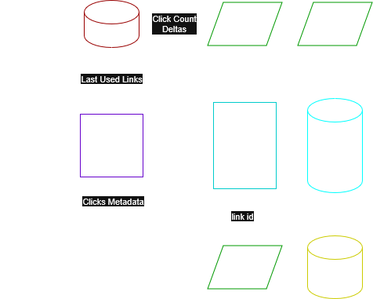

# VULSA — Very Unique Link Shortener API

Backend-проект сервиса коротких ссылок на **FastAPI** с DDD/Clean Architecture подходом.

---

## О проекте

**VULSA** — это API для сокращения ссылок, авторизации пользователей и сбора аналитики переходов.

Проект реализует прикладной сервис Python с разделением на домен, use cases, инфраструктуру и API-слой, с рядом фоновых воркеров и несколькими хранилищами данных под разные задачи.



---

## Технологии

### Backend и архитектура
- **Python 3.10+**
- **FastAPI** — REST API и redirect endpoint
- **Pydantic v2** — схемы запросов/ответов и валидация
- **Dependency Injector** — DI-контейнер
- **DDD + Use Case слой + UoW** — раздельные доменные сущности, интерфейсы репозиториев и сценарии

### Данные и инфраструктура
- **PostgreSQL + SQLAlchemy (async)** — основное хранилище
- **PgBouncer** — пул соединений к Postgres
- **Redis** — кэш ссылок
- **Kafka (aiokafka)** — события кликов по коротким ссылкам
- **ClickHouse** — хранение clickstream/аналитики
- **Alembic** — миграции схемы Postgres

### Фоновые процессы
- **Celery** — периодические/фоновые задачи
- Отдельный **Kafka worker** для обработки кликов

### DevOps/локальный запуск
- **Docker + docker-compose**
- **Uvicorn**
- **Pytest**

---

## Реализованные функции

### 1) Ссылки
- Создание короткой ссылки (в т.ч. анонимно)
- Поддержка кастомного `short`
- Установка срока действия (`expires_at`)
- Ограничение числа редиректов (`redirect_limit`)
- Редактирование параметров ссылки
- Удаление ссылки
- Получение списка ссылок с фильтрами/пагинацией

### 2) Редирект
- Перенаправление по короткой ссылке `/{short}` с HTTP 307
- Проверка ограничений доменной модели:
  - истечение срока
  - неактивный статус
  - лимит переходов
- Учёт переходов (сначала через кэш/БД, затем публикация события о клике)

### 3) Пользователи и роли
- Регистрация пользователя
- Получение текущего пользователя (`/users/me`)
- Удаление пользователя по подтверждению email+password
- Ролевая модель и permissions

### 4) Аутентификация
- Логин
- Access + Refresh токены
- X-Edit-Key для анонимных ссылок

### 5) Администрирование
- Добавление permission в роль
- Удаление permission из роли

### 6) Health checks
- `/api/v1/health/live` — жив ли API
- `/api/v1/health/ready` — готовность зависимостей (Postgres, Redis, Kafka, ClickHouse)

### 7) Background jobs
- Celery-задача синхронизации ссылок в кэш
- Celery-задача удаления старых/expired ссылок
- Kafka worker обработки кликов и записи аналитики

---

## Структура проекта

```text
src/
├── api/ # HTTP слой (FastAPI routers, schemas, dependencies)
│ └── v1/
├── domain/ # Доменные сущности, value objects, исключения
├── usecase/ # Бизнес логика (application layer)
├── infrastructure/ # Репозитории, UoW, SQLAlchemy, Redis, Kafka, ClickHouse
├── workers/ # Celery и Kafka воркеры
├── redirect/ # Endpoint короткого редиректа /{short}
├── migrations/ # Alembic + SQL(clickhouse) миграции
├── app.py # Точка входа FastAPI + lifespan
├── container.py # DI-контейнер
└── settings.py # Загрузка конфигурации из YAML
```

---

## Запуск с Docker

### 1. Подготовка переменных окружения

```bash
# ./
cd build
cp .example.env .env
```

### 2. Запуск всех сервисов

```bash
# ./build/
docker compose up --build
```

После запуска API будет доступен на:
- `http://localhost:9100/api/v1`
- Swagger: `http://localhost:9100/docs`
- Redirect: `http://localhost:9100/short`

### 3. Миграции

Применить миграции Postgres:

```bash
# ./
PYTHONPATH=src alembic upgrade head
```

---

## Тесты

```bash
# ./tests
PYTHONPATH=src pytest -q
```

---

## Примеры API

### Создать короткую ссылку

`POST /api/v1/links`

```json
{
"long": "https://example.com/some/very/long/path",
"short": "my-alias",
"redirect_limit": 100,
"expires_at": "2026-12-31T23:59:59Z"
}
```

### Логин

`POST /api/v1/auth/login`

```json
{
"email": "user@example.com",
"password": "strong_password"
}
```

### Редирект

`GET /{short}`

```text
GET /my-alias -> 307 Temporary Redirect -> https://example.com/some/very/long/path
```